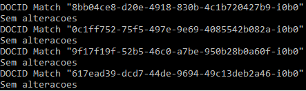

# ledselecao

Seguem algumas demonstrações dos algoritmos

<h3>Parte 1 - A</h3>

  Notado o padrão que a falta de dados poderia ser "" ou qualquer variância disso, assim o algoritmo foi implementado.

<h3>Parte 1 - B</h3>

  Classificando os estados de acordo com a ordem alfabética das listas de estado dos EUA.

<h3>Parte 1 - C</h3>

    Foi feito de forma que analisasse se o tamanho equivalia a cinco digitios e se esses digitos eram todos números, dado que quase todos os países
  do mundo, incluindo o EUA, utilizam-se de zipcodes com 5 digitos numéricos

<h3>Parte 1 - D</h3>

  Separação do Address de acordo com o PDF.  

<h3>Parte 2 - B</h3>

Algumas das possíveis anomalias investigadas foram idade fora do padrão, data de nascimento não batendo com a idade, grupo prioritário não batendo com a idade, erro na Unidade Federativa (UF), erro nas datas de vacinação e etc.

<h3>Parte 2 - C - Discussão da segurança dos dados</h3>

Existem alguns problemas na base de dados quanto a alguns dados sensíveis, mesmo que as informações de document_id e paciente_id estejam criptografadas, o que é correto diante a extrema sensiblidade desses dados, informações como data de nascimento, região do CEP e função profissional daqueles que trabalham na área de saúde ainda estão disponíveis. Esses
dados podem ser utilizados para gerar informações sobre quantidade de "nutricionistas" em tal região do CEP, ou a idade das mesmas. Seria mais interessante apenas as informações de faixa etária do paciente, e apenas indicar que o mesmo trabalha na área de saúde, podendo utilizar-se como documento por exemplo os codigos dos Conselhos de Classe. Em suma, há brechas para categorizações que levariam a uma melhor anonimazação dos dados, evitando que esses dados possam ser explorados para outras finalidades além da fiscalização e conhecimento da vacinação no país.

Pode-se também fazer um relacionamento de quantidade de nutricionistas por etnia e outras variações. Dado serem dados sensíveis, cabe deixar a fiscalização por parte do grupo in loco da vacinação, com a finalidade de não expor esses dados, principalmente de idade e etnia, para qualquer cidadão.

<h3> Parte 3</h3>

Parte de Match com ou sem alterações. Fiz apenas a parte do match com alterações ou não de registros.

