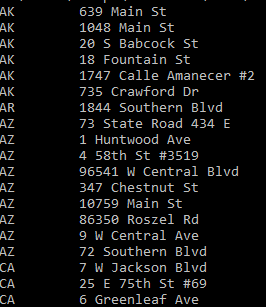
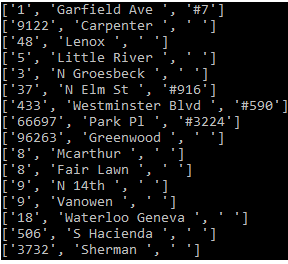

# ledselecao

Seguem algumas demonstrações dos algoritmos

<h3>Parte 1 - B</h3>

<h3>Parte 1 - D</h3>

<h3>Parte 2 - B</h3>

<h3>Parte 2 - C - Discussão da segurança dos dados</h3>

Existem alguns problemas na base de dados quanto a alguns dados sensíveis, mesmo que as informações de document_id e paciente_id estejam criptografadas, o que é correto diante
a extrema sensiblidade desses dados, informações como data de nascimento, região do CEP e função profissional daqueles que trabalham na área de saúde ainda estão disponíveis. Esses
dados podem ser utilizados para gerar informações sobre quantidade de "nutricionistas" em tal região do CEP, ou a idade das mesmas. Seria mais interessante apenas as informações
de faixa etária do paciente, e apenas indicar que o mesmo trabalha na área de saúde, podendo utilizar-se como documento por exemplo os codigos dos Conselhos de Classe.

Pode-se também fazer um relacionamento de quantidade de nutricionistas por etnia e outras variações. Dado serem dados sensíveis, cabe deixar a fiscalização por parte do
grupo in loco da vacinação, com a finalidade de não expor esses dados, principalmente de idade e etnia, para qualquer cidadão.

<h3> Parte 3</h3>

